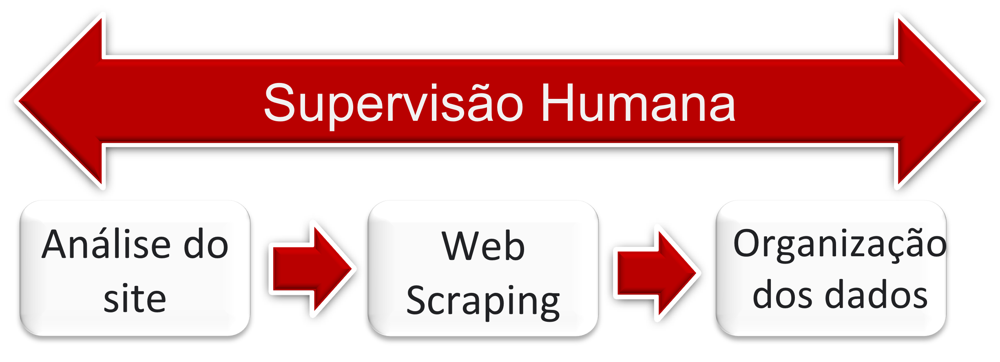

# Web-Scraping

<!---Esses são exemplos. Veja https://shields.io para outras pessoas ou para personalizar este conjunto de escudos. Você pode querer incluir dependências, status do projeto e informações de licença aqui--->




O Web Scraping ou Web Extraction é uma técnica eficiente amplamente conhecida e poderosa para coletar grandes volumes de dados, e devido a sua importância essa ferramenta é de suma utilidade na obtenção de informações, de modo que, através dela é possivel se construir banco de dados

## 💻 Pré-requisitos

Antes de começar, verifique se você atendeu aos seguintes requisitos:
* Você instalou a versão mais recente do `Anaconda`
* * Você instalou a versão mais recente do `Python`
* Você tem uma máquina `<Windows / Linux / Mac>`.
* Você possui espaço suficiente para armazenar as imagens que serão baixadas `aproximadamente 2 GB por classe`.


## ☕ Utilizando <Web Scraping>

Para usar <Web Scraping>, siga estas etapas:
1. Colocar o Notebook em uma pasta que deseja baixar as imagens.
2. Executar o Notebook.
```
<[https://www.youtube.com/watch?v=ukuy2XXirTU]>
```


## 📝 Observações

Como este modelo de Web Scraping extrai as informações do site (https://www.shipspotting.com/), qualquer alteração no layout da página pode deixar os códigos inválidos, sendo necessário uma reavaliação do mesmo.
[⬆ Voltar ao topo](#nome-do-projeto)<br>
